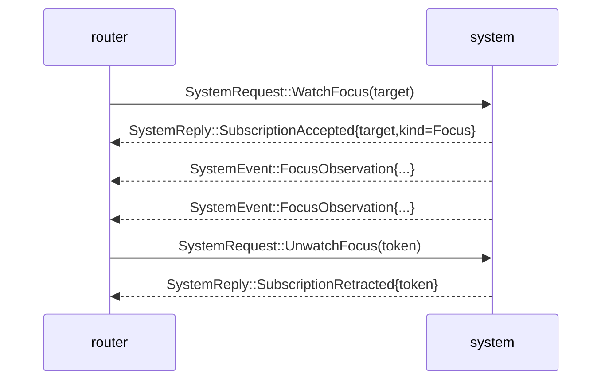

# signal-system — architecture

*The Signal contract between `system` (producer of OS facts)
and `router` (consumer of focus observations).*

## 0 · TL;DR

`signal-system` carries one bidirectional channel between the
router (request side, opens subscriptions) and the system observer
(reply / event side, emits focus observations). The router subscribes
once per target and the system pushes events; the router never polls.

## Three-layer model

**Layer 1 — Contract Operations on the wire (this crate).** Drop the
Sema-shaped prefixes entirely. The contract-local operation heads are
`WatchFocus`, `UnwatchFocus`, `QueryFocus`, and `QueryStatus`.
Payload names stay domain nouns (`FocusSubscription`,
`FocusSubscriptionToken`, `FocusSnapshot`, `SystemStatusQuery`).

**Layer 2 — Component Commands (system daemon).** The system
daemon owns its typed Command enum (e.g.
`SystemCommand::OpenFocusSubscription`,
`SystemCommand::CloseFocusSubscription`,
`SystemCommand::ReadFocusSnapshot`,
`SystemCommand::ReadSystemStatus`) plus a `CommandExecutor`.

**Layer 3 — Sema classification (signal-sema).** Each Component
Command projects to a payloadless `SemaOperation` class via
`ToSemaOperation`.

**Frame layer.** This crate uses `signal-frame`. Because this contract
still owns NOTA round-trip witnesses, it explicitly enables
`signal-frame/nota-text` through its own default `nota-text` feature
instead of relying on text codecs in the frame kernel's default build.

Permanent references:
- `primary/skills/component-triad.md` §"Verbs come in three layers"
- `primary/skills/contract-repo.md` §"Public contracts use contract-local operation verbs"

Subscription close follows the **Path A** discipline: a typed
request-side `UnwatchFocus` carries the per-stream token; the system
responds with
`SystemReply::SubscriptionRetracted` echoing the token. Both the
request retraction and the reply ack exist; the kernel grammar
(`signal-frame::signal_channel!`) requires the stream block to name a
typed close operation.

> Status: `system` is paused per its own ARCHITECTURE.md
> §0.7. This contract holds the Path A shape; the system unpauses
> with a real consumer reading `SystemReply::SubscriptionRetracted`
> to terminate its in-flight `FocusSubscription`.

## 1 · Channel

| Side | Component |
|---|---|
| Request side | `router` |
| Reply / event side | `system` |

The router initiates subscriptions via `SystemRequest`; the system
answers direct requests with `SystemReply` and pushes `SystemEvent`
events as focus state changes. The channel is bidirectional; the
steady-state flow is system → router (push events on the open
`FocusEventStream`).

Per `~/primary/skills/push-not-pull.md`, this channel IS the push
substrate. The router subscribes once per target and waits for
events.

## 2 · Wire vocabulary

Records local to this contract: `SystemTarget`, `NiriWindowId`,
`ObservationGeneration`, `FocusSubscription`,
`FocusSubscriptionToken`, `FocusSnapshot`, `SystemStatusQuery`,
`SystemBackend`, `FocusObservation`, `WindowClosed`,
`SubscriptionAccepted`, `SubscriptionKind`,
`ObservationTargetMissing`, `SystemStatus`, `SystemHealth`,
`SystemReadiness`, `SubscriptionRetracted`,
`SystemRequestUnimplemented`, `SystemUnimplementedReason`,
`SystemOperationKind`.

If a future channel needs `SystemTarget` (e.g. a harness-discovery
channel), make or update the relation-specific `signal-*`
contract for that relation. Do not lift system-observation payloads
into another component's contract; this crate owns the system
observation vocabulary.

## 3 · Messages

```text
SystemRequest                            SystemReply
├─ WatchFocus(FocusSubscription)         ├─ SubscriptionAccepted
├─ UnwatchFocus(FocusSubscriptionToken)  ├─ SubscriptionRetracted(token)
├─ QueryFocus(FocusSnapshot)             ├─ ObservationTargetMissing
└─ QueryStatus(SystemStatusQuery)        ├─ SystemStatus
                                         ├─ SystemRequestUnimplemented
                                         └─ QueryFocusReply

SystemEvent (on FocusEventStream)
├─ FocusObservation
└─ WindowClosed
```

The full lifecycle:



The closing exchange — request retract + reply ack — is the **Path A**
discipline. The retract request is required by the
`signal_channel!` macro's stream-block grammar: every `stream` block
names exactly one request-side close operation.
The reply ack is the final event consumers bind their in-flight
subscribe to. `FocusSubscriptionToken` is the per-stream identity
(`{ target: SystemTarget }`); the same shape as `FocusSubscription`
but a distinct type so subscribe / close sites do not conflate "open
this stream" with "name the stream to close."

## 4 · Sema-class projections (Layer 3)

Each contract-local operation's daemon-side Component Command
projects to a payloadless Sema class label for observation:

```text
WatchFocus (FocusSubscription)          -> Subscribe   (opens FocusEventStream)
UnwatchFocus (FocusSubscriptionToken)   -> Retract     (closes FocusEventStream)
QueryFocus (FocusSnapshot)              -> Match
QueryStatus (SystemStatusQuery)         -> Match
```

The wire form carries the contract-local verb only; the Sema class
label is computed at observation publish time inside the daemon.
Subscriptions open a push stream. Retractions close that stream and
the system acks with `SystemReply::SubscriptionRetracted` carrying
the token (Path A).

`SystemStatusQuery` and `SystemStatus` are the daemon-skeleton
readiness surface for the component itself. A valid request whose
runtime behavior is not built yet returns
`SystemReply::SystemRequestUnimplemented` carrying typed
`SystemUnimplementedReason`; it is a typed reply, not a text error
or a hang.

## 5 · Closed-enum integrity

```text
SystemBackend
  | Niri

SystemHealth
  | Running
  | Degraded
  | Stopped

SystemReadiness
  | Ready
  | Starting
  | Unavailable

SubscriptionKind
  | Focus

SystemUnimplementedReason
  | NotBuiltYet
  | BackendUnavailable

SystemOperationKind
  | WatchFocus
  | UnwatchFocus
  | QueryFocus
  | QueryStatus
```

`SystemTarget` is a closed enum (`NiriWindow(NiriWindowId)`); future
backends add variants through a coordinated schema upgrade. The
contract has no `Unknown` variant on any wire enum.

## 6 · Constraints

| Constraint | Witness |
|---|---|
| Subscription close uses **Path A** — a request-side `UnwatchFocus` operation carrying a typed token, plus a reply-side `SubscriptionRetracted` ack echoing the token. | The `signal_channel!` declaration names `operation UnwatchFocus(FocusSubscriptionToken)` and a `stream FocusEventStream { close UnwatchFocus; … }` block. `focus_subscription_retraction_round_trips` and `subscription_retracted_reply_round_trips` are the wire witnesses. |
| Wire enums contain no `Unknown` variant. | Every closed enum in `src/lib.rs` is exhaustively matched in `tests/round_trip.rs::system_status_enums_are_closed_no_unknown_variants`. |
| Any record name containing the word `Unknown` represents a positive "entity not in our state" rejection, not a polling-shape escape hatch. | This crate has no such records; absence is named positively (`ObservationTargetMissing`). |
| Each variant's NOTA head matches the contract-local verb declared in `signal_channel!`. | Generated by the macro; round-trip tests assert each variant's head. Sema classification is daemon-side projection only. |
| Round-trip witnesses cover every variant in rkyv. | `tests/round_trip.rs` covers every request, reply, and event variant through `Frame::encode_length_prefixed` / `decode_length_prefixed`. |
| Round-trip witnesses cover every variant in NOTA. | `examples/canonical.nota` holds one canonical text example per request/reply/event variant; round-trip tests parse and re-emit each. |
| No stringly-typed dispatch (`match s.as_str()`) for closed-set states. | All target / backend / health / readiness / reason fields are typed closed enums. `SystemTarget` carries a hand-written NOTA codec (the variant head IS structural) but does not parse free text. |
| `SystemStatusQuery` answers with typed `SystemReply::SystemStatus` or `SystemReply::SystemRequestUnimplemented`. | `system_status_query_round_trips_*` and `system_request_unimplemented_round_trips_*`. |
| The `FocusSubscriptionToken` carried by the unwatch request matches the token echoed in the `SubscriptionRetracted` reply. | The stream block declaration `token FocusSubscriptionToken; close UnwatchFocus` plus the retraction round-trip witnesses. |
| Contract crate dependencies use a named API reference (branch or tag), not a raw revision pin. | `Cargo.toml` review: `signal-frame` is declared `git = "..."` with a named-branch shape; raw `rev = "..."` pins are not used. |
| Runtime code stays out of the contract. | Source scan: no Kameo, Tokio, socket, or redb code. |

## 7 · NOTA codec shape

The `signal_channel!` macro emits a request variant's NOTA head as
the contract-local operation head. For example,
`SystemRequest::UnwatchFocus(FocusSubscriptionToken { .. })` encodes
as `(UnwatchFocus ((NiriWindow 223)))`. Canonical examples and
round-trip tests carry those operation heads.

`SystemTarget` is the exception: it has a hand-written NOTA codec so
the text form names the variant head (`NiriWindow 223`) — that head
is the typed payload, not a wrapper.

## 8 · Versioning

`signal_frame::Frame` carries the protocol version. Schema-level
changes (adding a new subscription kind, observation event variant,
or `SystemBackend` value) are breaking; coordinate `system`
and `router` on the upgrade.

This crate depends on `signal-frame` via a named-branch reference, not
a raw revision pin. The destination is a stable `signal-frame` API
branch/bookmark once that lane is declared.

## 9 · Non-ownership

- No Niri adapter — that is `system`.
- No focus-tracker actor — that is `system`.
- No terminal prompt-gate logic — that is `terminal` /
  `terminal-cell`.
- No transport (UDS path, reconnect, timeouts).
- No subscription accounting — that is `system`'s actor.
- No runtime implementation of status handling — the contract owns
  only the typed records.

## 10 · Code map

```text
src/
└── lib.rs                — payloads + signal_channel! invocation
examples/
└── canonical.nota         — one canonical example per request/reply/event variant
tests/
└── round_trip.rs          — per-variant frame round trips + NOTA witnesses
                             + closed-enum + verb-mapping witnesses
                             + canonical examples parser
                             + full subscribe/event/retract/ack lifecycle witness
```

## See also

- `signal-frame/macros/src/validate.rs` — the macro and stream-block
  grammar that enforces the request-side retract variant.
- `~/primary/skills/component-triad.md` §"Verbs come in three layers".
- `signal-message/ARCHITECTURE.md` — companion channel that the
  router consumes alongside this one.
- `signal-terminal/ARCHITECTURE.md` and `signal-criome/ARCHITECTURE.md`
  — sibling contracts using the same
  Path A subscription discipline.
